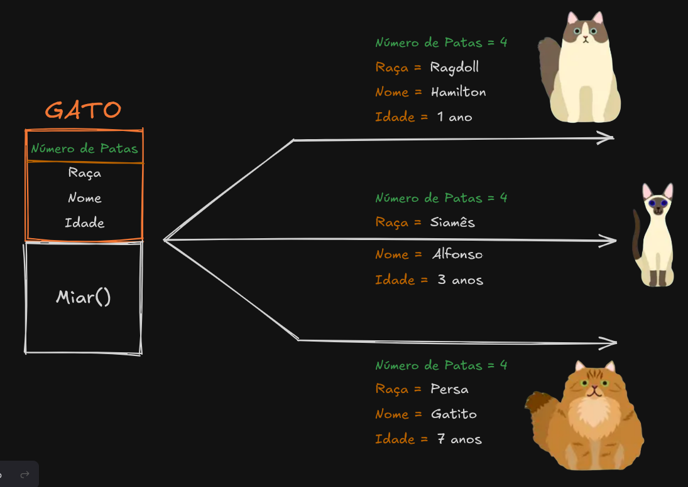

# Capítulo 00: Objetos e Classes

Agora que vocês já conheceram os mecanismos básicos do C++, vamos começar a pensar um pouco diferente. Entendemos como o C++ funciona de forma _procedural_. Agora veremos as coisas pelo prisma da **Orientação a Objetos**.

Neste capítulo, abordaremos os conceitos de _objetos_ e _classes_ e como podemos usá-los para dar ao nosso código escalabilidade e reutilizabilidade.

## 0.1 O que é a _Programação Orientada a Objetos_?

_"Veremos as coisas pelo prisma da Orientação a Objetos"_. Mas o que **é** a Orientação a Objetos? Onde vive? O que come?

A Programação Orientada a Objetos -- _ou POO, para os mais íntimos_ -- nada mais é do que
um conjunto de ideias, conceitos e regras. Um padrão que usamos para resolver alguns tipos
de problema específicos. Na orientação a objetos, tentamos representar entidades que podemos
ver na vida real, junto das suas características e comportamentos.

Digamos, por exemplo, que queremos representar um _gatinho_ no código >\^-\^<.

Na vida real, gatinhos têm características que são comuns a todos os outros gatos, como bigodes, garras, orelhas e etc. De mesmo modo, cada gato tem características próprias da sua raça. Um gato siamês tem uma pelagem naturalmente diferente de um ragdoll. Mesmo gatos da mesma raça podem diferir na cor dos olhos ou no padrão da pelagem. Além disso, gatos podem expressar comportamentos como miar, pular, arranhar as coisas, empurrar objetos de superfícies, e por aí vai.

Com tantas características comuns e divergentes, como então podemos representar esse gatinho
no nosso programa?

## 0.2 O que são _classes_?

Para criarmos um gatinho, primeiro precisamos saber como representar gatos em geral. Classes
são como um molde que usamos para criar vários objetos semelhantes, mas diferentes. Elas permitem agruparmos objetos com um mesmo conjunto de características (**atributos**) e comportamentos
(**métodos**).

No nosso caso, a espécie "gato" é a classe. Gatito, o gatinho que queremos representar, seria
uma **instância concreta** -- ou melhor, um _objeto_ -- dessa classe.

A classe é quem determina quais são os elementos comuns aos objetos que a instanciam, enquanto
o objeto vai guardar as informações específicas sobre ele. Assim, a classe Gato teria o número
de patas que um gato possui ou a classe biológica _(mamífero)_ à qual os gatos pertencem como atributos **estáticos** -- pertencentes a todos os membros da classe e não a uma instância --
e raça, nome e idade como atributos de instância. Também contém os métodos que podem ser chamados pelos objetos, como miar, e o que esse método fará efetivamente quando for chamado.

```cpp
classe Gato {
   //----- ESTÁTICOS ----- //
   atributo mamifero = true;
   atributo numero_patas = 4;

   //--- NÃO-ESTÁTICOS ---//
   atributo nome;
   atributo idade;
   atributo raca;

   void miar(){
      cout << "Miau!!" << endl;
   }
}
```

## 0.3 O que são _objetos_?

Já os objetos são, basicamente, ocorrências específicas das entidades que tentamos representar. Eles instanciam uma classe e guardam informações que não valem para todas as ocorrências daquela classe em atributos não-estáticos.

Desse modo, se definirmos o Gatito como um objeto da classe gato, podemos determinar e acessar
as informações sobre o Gatito (como raça, cor do olho e do pelo). Além disso, podemos saber que
o Gatito tem 4 patas e é mamífero, afinal ele é um Gato. Ainda, ele pode fazer uso de alguns métodos da classe Gato, afinal _todo gato pode miar_, mas quem mia de fato é o Gatito.

Aqui vão alguns exemplos de como atribuir um valor aos atributos de um objeto. Não recomendo que tente ainda, afinal **vai gerar erro**. Ainda vamos aprender alguns conceitos necessários para, de fato, criar classes e objetos.

```cpp
   //Cria o objeto
   Gato gatito;

   //Determina o valor desses atributos
   gatito.nome = "Gatito";
   gatito.idade = 7;
   gatito.raca = "PERSA";

   //Chama o método e executa seu código
   gatito.miar();
```

A seguir, um esquema visual para ajudar a entender a relação entre classes e seus objetos:



## Código de verdade

Tendo em vista que você já chegou até aqui neste material, seria talvez uma certa perda de tempo permanecer em pseudocódigo. Não vamos subestimar as suas capacidades dessa maneira. A partir de agora, é mão na massa!

A sintaxe mais básica para construir classes não é nada de outro mundo. Na verdade, é bem semelhante ao que já foi descrito conceitualmente acima!

**Exemplo: traduza o pseudocódigo anterior para a sintaxe real do C++**

A sintaxe para declarar uma **classe** em **C++** funciona, simplesmente, a partir do uso do termo **class** seguido do nome que sua classe terá. Uma padronização é sempre manter maiúsculo o primeiro caractere do nome dela:

```cpp
class Gato{
    // Código aqui
};
```

Lembra bastante a declaração de uma estrutura, não? Ela será declarada fora do escopo de funções, como por exemplo a `main()`.

Agora, queremos colocar os nossos atributos lá:

```cpp
#include <string>

class Gato{
    bool mamifero = true;
    int numero_patas = 4;

    std::string nome;
    int idade;
    std::string raca;
};
```

Mas, espera, lembra que `mamifero` e `numero_patas` são atributos estáticos e constantes? Como representamos isso na sintaxe?

Lembra dos capítulos da parte de `Introducao-Cpp`? Lá, temos um sobre variáveis locais estáticas. Para programar, temos a utilização do termo `static`. E, aqui não é diferente:

```cpp
class Gato{
    static bool mamifero = true;
    static int numero_patas = 4;

    std::string nome;
    int idade;
    std::string raca;
};
```

MASSS, seria legal fazer algo nesse sentido aqui:

```cpp
class Gato{
    // Pertence à classe e é imutável
    static const bool mamifero = true;
    static const int numero_patas = 4;

    std::string nome;
    int idade;
    std::string raca;
};
```

Perceba que adicionamos, também, o termo `const` depois de `static`.

Se o valor é fixo para toda a classe e nunca vai ser alterado (como o número de patas de um gato), usar `static const` é a forma mais clássica e segura: ideal para valores que não mudam.

Se for necessário um atributo estático que pode mudar ao longo do tempo (por exemplo, algo booleano, ou um contador global), o `C++17` facilitou muito a vida com o `inline`:

```cpp
class Gato{
    // Pertence à classe e é imutável
    static const bool mamifero = true;
    static const int numero_patas = 4;
    // Pertence à classe e pode ser alterado
    inline static bool buchoCheio = true;

    std::string nome;
    int idade;
    std::string raca;
};
```

Por fim, vamos adicionar o nosso método `miar()`:

```cpp
#include <iostream>
#include <string>

class Gato{
    // Pertence à classe e é imutável
    static const bool mamifero = true;
    static const int numero_patas = 4;
    // Pertence à classe e pode ser alterado
    inline static bool buchoCheio = true;

    std::string nome;
    int idade;
    std::string raca;

    void miar(){
        std::cout << "MIAU" << std::endl;
    }

};
```

Maravilha! Temos a nossa classe. Que tal testar um pouco rodando na `main()`?

```cpp
#include <iostream>
#include <string>

class Gato{
    // Pertence à classe e é imutável
    static const bool mamifero = true;
    static const int numero_patas = 4;
    // Pertence à classe e pode ser alterado
    inline static bool buchoCheio = true;

    std::string nome;
    int idade;
    std::string raca;

    void miar(){
        std::cout << "MIAU" << std::endl;
    }

};

int main(){
    //Cria o objeto
    Gato gatito;

    //Determina o valor desses atributos
    gatito.nome = "Gatito";
    gatito.idade = 7;
    gatito.raca = "PERSA";

    //Chama o método e executa seu código
    gatito.miar();

    return 0;
}
```

Simplesmente, realizamos um copia e cola do que já havíamos feito anteriormente!

Porém, ainda não acabamos. Você não conseguirá compilar o código nesse estado. Existe um detalhe a respeito da acessibilidade de tudo que está dentro da classe: eles, por padrão, não são acessíveis fora dela. Isso será melhor explicado no capítulo sobre `Modificadores de Acesso`, então não deixem de conferir!

Mas, como podemos resolver isso por ora? Adicionando o termo `public` na nossa classe, antes dos atributos e métodos. Isso faz com que eles sejam acessíveis em toda parte:

```cpp
class Gato {

public:
    // Pertence à classe e é imutável
    static const bool mamifero = true;
    static const int numero_patas = 4;
    // Pertence à classe e pode ser alterado
    inline static bool buchoCheio = true;

    std::string nome;
    int idade;
    std::string raca;

    void miar(){
        std::cout << "MIAU" << std::endl;
    }
};
```

Agora sim, compilando e rodando:

```
MIAU
```

Inclusive, já que incluimos variáveis estáticas, é justo provar que elas pertencem à classe `Gato` em si, não especificamente ao `gatito`.

Na nossa `main()`, vamos adicionar:

```cpp

int main(){
    //Cria o objeto
    Gato gatito;

    //Determina o valor desses atributos
    gatito.nome = "Gatito";
    gatito.idade = 7;
    gatito.raca = "PERSA";

    //Chama o método e executa seu código
    gatito.miar();

    //Printando variáveis estáticas
    std::cout << Gato::mamifero << std::endl;
    std::cout << Gato::numero_patas << std::endl;
    std::cout << Gato::buchoCheio << std::endl;

    return 0;
}
```

Acessamos diretamente a classe a partir dos `::`.

Compilando e rodando:

```cpp
MIAU
1
4
1
```

> Caso você não se lembre, o "1" corresponde ao true do bool!

## Conclusões

Nesta primeira parte do capítulo, conhecemos alguns conceitos na teoria. Logo em seguida, passamos para a sintaxe do C++. Em sequência, vamos entender um pouco melhor sobre o que são construtores e como escrevê-los, além de algumas especificidades do C++. Fique de olho e não perca a Parte 2!
