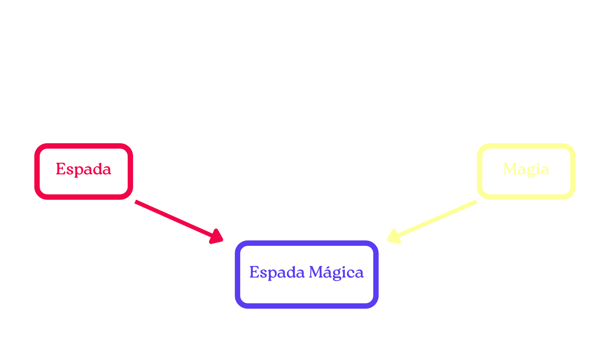

# Capítulo 02: Herança e Polimorfismo

## 2.1 Herança

No capítulo anterior, acabamos adiantando um pouco o tópico de **herança**, por motivos de força maior. Agora, poderemos tratar com um pouco mais de calma e verificar todo o potencial dessa ferramenta aqui no `C++`!

A herança permite com que possamos reaproveitar código, reaplicando métodos/atributos de uma classe para suas derivadas. Dessa maneira, evitamos bastante **código redundante** de maneira bem elegante e precisa.

Imagine que você esteja modelando um sistema de equipamentos para um jogo de RPG. Como funcionaria isso em **orientação a objetos**?

> Nota: Vamos começar escrevendo tudo em um arquivo só para entender a lógica, mas não se preocupe! Logo mais vamos refatorar isso para o padrão profissional do C++

**Exemplo: construa um sistema de equipamentos em um arquivo separado do `Main.cpp`, aplicando o conceito de herança**

Em um arquivo chamado `Equipamento.cpp`, a seguinte programação já é um bom começo:

```
Equipamento.cpp
```

```cpp
#include "Equipamento.hpp"
#include <string>
class Equipamento {
private:
  std::string nomeEquipamento;
  int ganhoDeAtaque;
  int ganhoDeEstamina;
  int ganhoDeDefesa;
  int ganhoDeMagia;

public:
  // Construtor
  Equipamento(std::string nomeEquipamento, int ataque,
      int estamina, int defesa, int magia) {
          this->nomeEquipamento = nomeEquipamento;
          this->ganhoDeAtaque = ataque;
          this->ganhoDeEstamina = estamina;
          this->ganhoDeDefesa = defesa;
          this->ganhoDeMagia = magia;
  }
  // Getters
  std::string getNomeEquipamento() { return nomeEquipamento; }
  int getGanhoDeAtaque() { return ganhoDeAtaque; }
  int getGanhoDeEstamina() { return ganhoDeEstamina; }
  int getGanhoDeDefesa() { return ganhoDeDefesa; }
  int getGanhoDeMagia() { return ganhoDeMagia; }

  // Setters
  void setNomeEquipamento(std::string novoNome) {
    nomeEquipamento = novoNome;
  }
  void setGanhoDeAtaque(int novoAtaque) { ganhoDeAtaque = novoAtaque; }
  void setGanhoDeEstamina(int novaEstamina) { ganhoDeEstamina = novaEstamina; }
  void setGanhoDeDefesa(int novaDefesa) { ganhoDeDefesa = novaDefesa; }
  void setGanhoDeMagia(int novaQntdMagia) { ganhoDeMagia = novaQntdMagia; }
};
```

Aqui, definimos alguns atributos básicos como `private` e preparamos a nossa API na forma dos `Getters/Setters`.

Maravilha! O que fazer a seguir?

Na classe `Equipamento` acima, definimos um molde com as características mais gerais. E se quiséssemos criar classes que implementassem aquelas mesmas características, só que com algumas adições que fizessem sentido especificamente com elas?

É aqui que a herança cumpre o seu papel. Agrupamos esse conceito em duas categorias diferentes:

**(i) Classes derivadas (filhas) - as classes que herdam de outras;**

**(ii) Classes Base (pais/mães) - as classes de onde as outras vão herdar.**

No nosso contexto do RPG, poderíamos criar, por exemplo, uma classe "Espada":

```cpp
class Espada : public Equipamento {

public:
  Espada(std::string nomeEquipamento, int ataque, int estamina,
         int defesa, int magia)
      : Equipamento(nomeEquipamento, ataque, estamina, defesa, magia) {}
};
```

Aqui, temos a nossa classe `Espada`, que é derivada (filha) da classe base (mãe) `Equipamento`.

A sintaxe para herdar de uma classe é, basicamente, dois pontos (`:`), do jeito que você pode observar acima em `class Espada : public Equipamento`.

Logo abaixo do `public`, temos aquela **sintaxe extensa**. Ela representa o construtor da nossa classe `Espada`.

Mas, por que ele tem aquela forma?

Conforme afirmamos anteriormente, a nossa classe derivada receberá **todos os atributos/métodos** da classe base. Isso faz com que seja necessário, também, inicializar os atributos herdados.

Para que isso seja possível, estruturamos o **construtor** da classe filha daquela maneira, meio que "ativando" o construtor da mãe sequencialmente, separando também por `:`.

Como não programamos nada de específico para `Espada`, seu construtor funcionará basicamente como uma "repetição" do construtor de `Equipamento`. Por isso que o nosso par de chaves `{}` está vazio até o momento.

Vamos adicionar algumas especificidades!

```cpp
enum lamina { reta, curva, falcata, tanto };

class Espada : public Equipamento {
private:
  double taxaDePerfuracao;
  lamina tipoDeLamina;

public:
  Espada(std::string nomeEquipamento, int ataque, int estamina,
         int defesa, int magia, double taxaDePerfuracao, lamina tipoDeLamina)
      : Equipamento(nomeEquipamento, ataque, estamina, defesa, magia) {

    this->taxaDePerfuracao = taxaDePerfuracao;
    this->tipoDeLamina = tipoDeLamina;
  }

  // Getters
  double getTaxaDePerfuracao() { return taxaDePerfuracao; }
  lamina getTipoDeLamina() { return tipoDeLamina; }

  // Setters
  void setTaxaDePerfuracao(double novaTaxa) { taxaDePerfuracao = novaTaxa; }
  void setTipoDeLamina(lamina novoTipo) { tipoDeLamina = novoTipo; }
};
```

Colocamos os dois atributos `taxaDePerfuracao` e `tipoDeLamina`. Aproveitamos para definir um **enum** para não nos apoiarmos em números mágicos.

Perceba que o construtor mudou. Agora, temos características específicas de `Espada` e, para inicializar os nossos objetos, é interessante colocar lá. Agora, temos atribuições dentro do nosso construtor: ativamos o da classe mãe e, em sequência, fazemos atribuições específicas para a filha.

Aproveitamos o código acima para também terminar de estabelecer a API de `Espada`.

Beleza! Temos essas duas. Mas, e se quiséssemos fazer uma terceira, que herdasse as características da filha? É possível? Claro!

No nosso RPG, imagine que podemos ter espadas mágicas. Vamos programar:

```cpp
class EspadaMagica : public Espada {
public:
  EspadaMagica(std::string nomeEquipamento, int ataque,
               int estamina, int defesa, int magia, double taxaDePerfuracao,
               lamina tipoDeLamina)
      : Espada(nomeEquipamento, ataque, estamina, defesa, magia,
               taxaDePerfuracao, tipoDeLamina) {}
};
```

Ora, ora! Temos uma classe **neta**. Exatamente! Podemos aplicar heranças sequenciais de maneira indefinida! Bem legal, né?

Agora, o que seria de uma espada mágica sem sua **magia**? Uma magia também pode ser um equipamento, se quisermos. Vamos lá:

```cpp
enum elemento { fogo, agua, terra, ar, luz, trevas };

class Magia : public Equipamento {
private:
  elemento tipoDeElemento;
  int custoDeMagia;
  int cooldown;

public:
  Magia(std::string nomeEquipamento, int ataque, int estamina,
        int defesa, int magia, elemento tipoDeElemento, int custoDeMagia,
        int cooldown)
      : Equipamento(nomeEquipamento, ataque, estamina, defesa, magia) {
    this->tipoDeElemento = tipoDeElemento;
    this->custoDeMagia = custoDeMagia;
    this->cooldown = cooldown;
  }

  // Getters
  elemento getTipoDeElemento() { return tipoDeElemento; }
  int getCustoDeMagia() { return custoDeMagia; }
  int getCooldown() { return cooldown; }


  // Setters
  void setTipoDeElemento(elemento novoTipo) { tipoDeElemento = novoTipo; }
  void setCustoDeMagia(int novoCusto) { custoDeMagia = novoCusto; }
  void setCooldown(int novoCooldown) { cooldown = novoCooldown; }
};
```

Construímos, aqui, a nossa classe de magia. Definimos, também, um novo `enum elemento`, os atributos `tipoDeElemento, custoDeMagia, coolDown` e seus `Getters/Setters`. Atualizamos, também, o construtor.

Agora, podemos combinar `Espada` e `Magia`em `EspadaMagica`!

Aplicamos, então, o conceito de `Herança Múltipla`, que acontece da seguinte maneira em `C++`:

```cpp
class EspadaMagica : public Espada, public Magia {
public:
  EspadaMagica(std::string nomeEquipamento, int ataque,
               int estamina, int defesa, int magia, double taxaDePerfuracao,
               lamina tipoDeLamina, elemento tipoDeElemento, int custoDeMagia,
               int cooldown)
      : Espada(nomeEquipamento, ataque, estamina, defesa, magia,
               taxaDePerfuracao, tipoDeLamina),
        Magia(nomeEquipamento, ataque, estamina, defesa, magia, tipoDeElemento,
              custoDeMagia, cooldown) {}
};
```

Ok, acabou ficando **mucho texto** esse código. Vamos com calma:

(i) A definição `class EspadaMagica : public Espada, public Magia{}` indica, justamente, a múltipla herança. Tudo o que vem depois de `:` e antes de `{}` diz respeito às classes base de onde `EspadaMagica` herdará;

(ii) O construtor `EspadaMagica(atributos) : Espada(parte dos atributos), Magia(parte dos atributos){}` indica a ativação sequencial de cada construtor das mães.

O código ficaria muito mais redundante e feio se tivéssemos que copiar e colar várias vezes as mesmas linhas! Criamos um sistema de equipamentos básicos de maneira bem elegante e eficiente!

Perceba que seria muito mais lógico e simples expandir o código a partir do que criamos até agora.

Masss, os olhos mais atentos que estão lendo este material devem ter percebido um pequeno problema que ignoramos até agora nos **modificadores de acesso**: para que as classes filhas acessem os atributos de maneira direta, devemos usar o `protected`! Assim, altere os atributos para:

```cpp
class Equipamento {
protected:
  std::string nomeEquipamento;
  int ataque;
  int estamina;
  int defesa;
  int magia;
};

class Espada : public Equipamento {
protected:
  double taxaDePerfuracao;
  lamina tipoDeLamina;
};

class Magia : public Equipamento {
protected:
  elemento tipoDeElemento;
  int custoDeMagia;
  int cooldown;
};
```

Tudo o que fizemos aqui ficou muito bonito e tudo mais. Porém, vamos esbarrar em alguns problemas na hora de construir uma implementação sólida na nossa `Main.cpp`, principalmente um dos clássicos da `Herança Múltipla`!

### O Problema do Diamante



Como `Espada` herda de `Equipamento` e `Magia` também herda de `Equipamento`, a `EspadaMagica` vai acabar tendo **duas cópias dos atributos de Equipamento na memória (dois nomes, dois ataques, etc)**. O compilador vai ficar confuso sem saber qual usar.

A solução: precisamos usar a palavra-chave **virtual** na herança.

Isso diz ao compilador: "Ei, se alguém herdar de Espada e Magia ao mesmo tempo, crie apenas UMA cópia de Equipamento e divida entre elas".

Então:

```cpp
// ADICIONADO 'virtual' AQUI
class Espada : virtual public Equipamento {
protected:
  double taxaDePerfuracao;
  lamina tipoDeLamina;

public:
  Espada(std::string nomeEquipamento, int ataque, int estamina,
         int defesa, int magia, double taxaDePerfuracao, lamina tipoDeLamina);

  double getTaxaDePerfuracao() { return taxaDePerfuracao; }
  lamina getTipoDeLamina() { return tipoDeLamina; }
  void setTaxaDePerfuracao(double novaTaxa) { taxaDePerfuracao = novaTaxa; }
  void setTipoDeLamina(lamina novoTipo) { tipoDeLamina = novoTipo; }
};

// ADICIONADO 'virtual' AQUI
class Magia : virtual public Equipamento {
protected:
  elemento tipoDeElemento;
  int custoDeMagia;
  int cooldown;

public:
  Magia(std::string nomeEquipamento, int ataque, int estamina,
        int defesa, int magia, elemento tipoDeElemento, int custoDeMagia,
        int cooldown);

  elemento getTipoDeElemento() { return tipoDeElemento; }
  int getCustoDeMagia() { return custoDeMagia; }
  int getCooldown() { return cooldown; }
  void setTipoDeElemento(elemento novoTipo) { tipoDeElemento = novoTipo; }
  void setCustoDeMagia(int novoCusto) { custoDeMagia = novoCusto; }
  void setCooldown(int novoCooldown) { cooldown = novoCooldown; }
};
```

Rapidamente, resolvemos essa questão. Isso também altera o construtor da nossa `EspadaMagica`, observe no próximo tópico.

### Aplicando em Main.cpp

Para realizar o uso de múltiplos arquivos, vamos criar o header `Equipamento.hpp`. Isso vai mudar o que implementamos até aqui em `Equipamento.cpp`. Acompanhe:

**Exemplo: implemente Equipamento.hpp e faça aplicações na função main()**

(i) O arquivo `.hpp` deve conter apenas a "planta" da classe. Ele diz quais são os atributos e as assinaturas dos métodos, mas não tem a lógica do que os métodos fazem. Também, temos mais alguns detalhes específicos.

```
Equipamento.hpp
```

```cpp
#ifndef EQUIPAMENTO_HPP
#define EQUIPAMENTO_HPP

#include <string>

enum lamina { reta, curva, falcata, tanto };
enum elemento { fogo, agua, terra, ar };

class Equipamento {
protected:
  std::string nomeEquipamento;
  int ataque;
  int estamina;
  int defesa;
  int magia;

public:
  Equipamento(std::string nomeEquipamento, int ataque,
              int estamina, int defesa, int magia);

  std::string getNome() { return nomeEquipamento; }
  int getAtaque() { return ataque; }
  int getEstamina() { return estamina; }
  int getDefesa() { return defesa; }
  int getMagia() { return magia; }
  void setNome(std::string novoNome) { nomeEquipamento = novoNome; }
  void setAtaque(int novoAtaque) { ataque = novoAtaque; }
  void setEstamina(int novaEstamina) { estamina = novaEstamina; }
  void setDefesa(int novaDefesa) { defesa = novaDefesa; }
  void setMagia(int novaMagia) { magia = novaMagia; }
};

class Espada : virtual public Equipamento {
protected:
  double taxaDePerfuracao;
  lamina tipoDeLamina;

public:
  Espada(std::string nomeEquipamento, int ataque, int estamina,
         int defesa, int magia, double taxaDePerfuracao, lamina tipoDeLamina);

  double getTaxaDePerfuracao() { return taxaDePerfuracao; }
  lamina getTipoDeLamina() { return tipoDeLamina; }
  void setTaxaDePerfuracao(double novaTaxa) { taxaDePerfuracao = novaTaxa; }
  void setTipoDeLamina(lamina novoTipo) { tipoDeLamina = novoTipo; }
};

class Magia : virtual public Equipamento {
protected:
  elemento tipoDeElemento;
  int custoDeMagia;
  int cooldown;

public:
  Magia(std::string nomeEquipamento, int ataque, int estamina,
        int defesa, int magia, elemento tipoDeElemento, int custoDeMagia,
        int cooldown);

  elemento getTipoDeElemento() { return tipoDeElemento; }
  int getCustoDeMagia() { return custoDeMagia; }
  int getCooldown() { return cooldown; }
  void setTipoDeElemento(elemento novoTipo) { tipoDeElemento = novoTipo; }
  void setCustoDeMagia(int novoCusto) { custoDeMagia = novoCusto; }
  void setCooldown(int novoCooldown) { cooldown = novoCooldown; }
};

class EspadaMagica : public Espada, public Magia {
public:
  EspadaMagica(std::string nomeEquipamento, int ataque,
               int estamina, int defesa, int magia, double taxaDePerfuracao,
               lamina tipoDeLamina, elemento tipoDeElemento, int custoDeMagia,
               int cooldown);
};

#endif
```

Ora, se o `.hpp` tem apenas as assinaturas dos métodos, por que implementamos os `Getters/Setters` aqui?

**Plot twist: na grande maioria dos projetos reais, getters e setters simples ficam no .hpp!**

Temos alguns motivos para isso:

**(i) Otimização (Inlining Automático)**

Quando você escreve o corpo da função diretamente dentro da declaração da classe no .hpp, o compilador do **C++** trata essa função como inline por padrão. Isso significa que, sempre que você chamar meuEquipamento.getAtaque(), o compilador não vai ter o trabalho (o custo de processamento) de "pular" para outra parte da memória para executar uma função. Ele vai simplesmente substituir a chamada diretamente pela instrução return ataque;. Isso deixa seu programa ligeiramente mais rápido!

**(ii) Código mais limpo**

Getters e setters geralmente têm apenas uma linha. Se você mover 10 getters e setters para o arquivo .cpp, você vai ter que escrever 30 ou 40 linhas de código "boilerplate" (repetitivo) usando a sintaxe Classe::metodo, o que não agrega valor. Manter isso no `.hpp` deixa o `.cpp` limpo e focado apenas na lógica complexa e importante do seu sistema.

Você só deve mover um getter ou setter para o .cpp se ele deixar de ser "simples". Se for apenas `return valor;` ou `variavel = valor;`, o lugar dele é no `.hpp`!

Mas, espera, sintaxe `Classe::metodo`???

Sim! Agora, vamos reestruturar bastante o nosso `Equipamento.cpp`. Vambora:

```
Equipamento.cpp
```

```cpp
#include "Equipamento.hpp"

// Implementação do construtor de Equipamento
Equipamento::Equipamento(std::string nome, int atq, int est, int def, int mag) {
    nomeEquipamento = nome;
    ataque = atq;
    estamina = est;
    defesa = def;
    magia = mag;
}

// Implementação do construtor de Espada
Espada::Espada(std::string nome, int atq, int est, int def, int mag,
               double taxa, lamina tipo)
    : Equipamento(nome, atq, est, def, mag)
{
    taxaDePerfuracao = taxa;
    tipoDeLamina = tipo;
}

// Implementação do construtor de Magia
Magia::Magia(std::string nome, int atq, int est, int def, int mag,
             elemento tipoElem, int custo, int cd)
    : Equipamento(nome, atq, est, def, mag)
{
    tipoDeElemento = tipoElem;
    custoDeMagia = custo;
    cooldown = cd;
}

// Implementação do construtor de EspadaMagica
// NOTA: Como usamos herança 'virtual', a classe "neta" (EspadaMagica) é a
// responsável por chamar o construtor da classe "avó" (Equipamento) diretamente!
EspadaMagica::EspadaMagica(std::string nome, int atq, int est, int def, int mag,
                           double taxa, lamina tipoLamina, elemento tipoElemento,
                           int custo, int cd)
    : Equipamento(nome, atq, est, def, mag), // Chama a classe avó
      Espada(nome, atq, est, def, mag, taxa, tipoLamina), // Chama a classe mãe 1
      Magia(nome, atq, est, def, mag, tipoElemento, custo, cd) // Chama a classe mãe 2
{
    // O corpo do construtor pode ficar vazio, pois a lista de inicialização acima já fez tudo.
}
```

Ok, ok! Um passo de cada vez...

O que havia ficado faltante nas classes do `.hpp`? **Os pormenores dos construtores**! No nosso `Equipamento.cpp`, você inclui o seu .hpp e usa o operador de escopo `::` para dizer ao compilador: "Ei, lembra daquele método atacar que eu prometi no HPP? Aqui está o código dele".

Como nossos únicos métodos eram `Getters/Setters` simples, todas as implementações deles ficaram no `.hpp`!

Além disso, como comentamos no código acima, agora que resolvemos corretamente o **Problema do Diamante** com a keyword `virtual`, precisamos chamar o construtor da **classe avó** diretamente para garantir a sua inicialização, já que a herança virtual eliminou a duplicação!

Então, finalmente terminamos a implementação em múltiplos arquivos. Para finalizar, vamos instanciar um objeto na função `main()`:

```
Main.cpp
```

```cpp
#include "Equipamento.hpp"
#include <iostream>

int main() {
  EspadaMagica frostmourne("Frostmourne", 100, 100, 100, 100, 1.0, reta, agua,
                           100, 100);

  std::cout << "Atributos: " << std::endl;
  std::cout << "Nome: " << frostmourne.getNome() << std::endl;
  std::cout << "Ataque: " << frostmourne.getAtaque() << std::endl;
  std::cout << "Estamina: " << frostmourne.getEstamina() << std::endl;
  std::cout << "Defesa: " << frostmourne.getDefesa() << std::endl;
  std::cout << "Magia: " << frostmourne.getMagia() << std::endl;
  return 0;
}
```

Todos os arquivos estão no mesmo diretório. Compilando e rodando teremos:

```sh
❯ ./Main
Atributos:
Nome: Frostmourne
Ataque: 100
Estamina: 100
Defesa: 100
Magia: 100
```

Perceba como separamos muito melhor as **responsabilidades**. Um usuário, programando apenas na `main()`, não precisa se preocupar com os pormenores de toda a nossa implementação anterior! Além disso, o código dele não terá interferência lá! Usufruímos da **Herança** muito bem e criamos uma **API** bem bacana!

### Conclusões

Você deu mais um importante passo no aprendizado de orientação a objetos! Na próxima parte, abordaremos **Polimorfismo**, que também é essencial. Continue!
